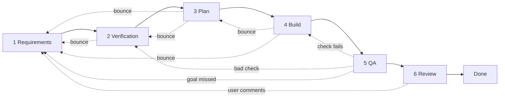

# Work Item Lifecycle

Every Work Item moves through these stages, in order — and any stage can send it back.

Solid arrows are the normal path. Dotted arrows are bounces — see "Bouncing back".

## Stages

| # | Stage | Who | What happens | Ready to move on when... |
|---|---|---|---|---|
| 1 | **Requirements** | Requirements agent | Write what must be true when the work is done | Each requirement is numbered (R1, R2, ...) and clear |
| 2 | **Verification** | Verification agent | Check the requirements, then write one or more checks for each | Every requirement has at least one check (V1, V2, ...) |
| 3 | **Plan** | Planner agent | Check stages 1–2, then decide how to do the work | Every requirement is covered by the plan |
| 4 | **Build** | Builder agent | Check the plan, then do the work in a PR | PR open, saying `Closes #<n>` |
| 5 | **QA** | QA agent (not the builder) | Run every check and record the evidence | Every `QA` check has passed, and the pre-merge part of every `after merge` check |
| 6 | **Human review** | The user | Look at the result (`/review`) | The user merges or comments |
| 7 | **Done** | — | The merged PR closes the Issue | — |

## Bouncing back

No agent checks its own output. Each stage is the first fresh look at the one before it,
so finding a problem upstream is normal work, not an exception.

**The mechanism is always the same: the `stage:` label goes back, and a comment says why.**
The label is the queue. A fresh agent for that stage picks the item up and reads the
comments above it. There is no separate "needs rework" state.

### Who can send it where

| From | Back to | When |
|---|---|---|
| 2 Verification | 1 Requirements | A requirement is wrong, unprovable, contradicts another, or goes beyond the goal |
| 3 Plan | 1 or 2 | A requirement can't be done, or a check can't be run or doesn't prove its R |
| 4 Build | 3 Plan | A step can't be carried out, or following it would leave an R unmet |
| 4 Build | 1 Requirements | A requirement turns out wrong or impossible |
| 5 QA | 4 Build | A check fails |
| 5 QA | 2 Verification | A check is wrong or can't be run as written |
| 5 QA | 1 Requirements | Every check passes but the goal plainly isn't met |
| 6 User | 1 Requirements | The user comments instead of merging |

### Three responses, chosen by cost

| Response | When | What happens |
|---|---|---|
| **Fix in place** | A factual, objectively correctable slip — a miscount, a wrong path, a typo'd filename | The finding agent corrects it in **its own** comment and says so. No bounce. Never for anything needing judgment. |
| **Bounce** | A decision the earlier stage owns — something is wrong, contradicts something else, or is out of scope | The `stage:` label goes back. The comment names what's wrong and what would settle it. |
| **Stop** | The goal itself is wrong or can't be done | Add `waiting:user` and ask. |

Bouncing re-runs a whole stage. Fix in place when you honestly can; bounce when the
judgment belongs to someone else.

- **Scan everything, bounce once.** Report every problem in one comment. Don't do your own
  stage's work first — it's wasted if the earlier stage changes.
- **Three strikes.** If a Work Item reaches the same stage a third time, stop: add
  `waiting:user` and say what keeps going wrong. Agents never ping-pong.

## When the user is involved

The user drops in twice, and no more than that:

1. **At the start**, to say what they want.
2. **At stage 6**, to review the finished result.

Everything between is the agents' problem. Do **not** stop to get requirements or a plan
approved. The only reasons to interrupt:

- The work would be destructive, or can't be undone.
- Two reasonable readings lead to very different results, and picking wrong would waste
  real effort.
- Something outside the agents' control is blocking it (access, a decision only the user
  can make, a bill to pay).
- A stage has been reached 3 times.

Anything less is a decision the agents make themselves. **Choose the option that is
easiest to undo, record it under `Decisions` in your stage comment, and it gets flagged at
stage 6.** Rejection is cheap because the choice was reversible.

## Waiting

A Work Item can be paused at any stage. It keeps its stage and resumes from there.

- `waiting:user` — stuck for one of the reasons above.
- `waiting:work` — another Work Item must finish first.

The user can cancel a Work Item at any time.

## Writing a good check

This is the most important rule in the system. It's what stops an agent from claiming
success without proof.

> **A check must name what to look at, and what would make it fail.**

| Good | Bad |
|---|---|
| Open `docs/menu.md`. It must not contain the word "daily". Fail if it does. | Confirm the menu is accurate. |
| Run `npm test`. All tests must pass. Fail on any error. | Make sure the code works. |
| Each claim in section 2 must have a source link. Fail if any claim has none. | Check that the research is solid. |

The user should be able to read the checklist and answer one question:
*"If all of these pass, am I happy?"*

### Checks that run after merge

Some checks can only be proven after merge — e.g. a change to the runner only takes effect
on the next real run from `main`.

- Verification marks every check `QA` (the default) or `after merge`, with a one-line
  reason for each `after merge`. Most Work Items have none.
- QA still does and records the pre-merge part: the change is in the diff, the syntax is
  valid, a local dry run where possible. The unproven rest doesn't fail or stall it. A
  check marked `after merge` that QA could have run is a bad check: QA fails it.
- QA ends its comment with a `### After merge` list: what to do, what counts as a fail.
- The user proves those checks after merging. Review shows them the list.

## How the Issue is written

- **Body: the goal only** — current state and desired state. Written once, never edited.
- **Each stage is its own comment**, headed `## 3. Plan — planner ✅` (`⤴` if it bounced,
  `❌` for a QA fail). A re-run is a new comment headed `## 3b. Plan (re-run) — planner ✅`,
  so the Issue reads top to bottom.
- The `stage:` **label** shows where the work is. The PR is linked by GitHub. Neither is
  repeated in the body.

## Rules for every agent

Each agent file adds only what's specific to its stage. These apply to all of them.

- **Read the digest top to bottom** (`scripts/runner/issue-digest.sh <repo> <n>`) — the goal,
  the latest comment from each stage, every human comment. Later comments correct earlier
  ones. Reach for the full history (`gh issue view <n> --comments`) only when the digest
  points at an earlier run you need to see.
- **Never edit an earlier comment.** A correction is a new comment below the old one. The
  Issue is the memory, and the memory includes the mistake.
- **Don't check your own work.** The next stage does. If you spot your own error after
  posting, leave it for them rather than quietly editing.
- **Never soften a requirement or a check** to match what was built or to make it pass.
- **Record every judgment call** under `Decisions`: the choice, then the reason, one line
  each. These become workflows later (see below).
- **End by setting the `stage:` label** — forward when done, back when bouncing.

### Keep it brief

Comments are read by the next agent and by the user on a phone.

- Tables and short bullets. Not prose.
- No preamble, no restating the goal, no summarising the comment above yours.
- Say a thing once. If it's in your table, it isn't in your notes too.
- Cut every word that isn't doing work — but never cut something the next agent needs.
  Brief is the goal; incomplete is a failure.

## How the user approves or rejects

- **Approve = merge the PR.** It says `Closes #<n>`, so merging closes the Work Item.
  Works from the GitHub phone app.
- **Reject = comment** what's wrong. An agent picks the comment up and moves the Work Item
  back to requirements.

## Workflows

The stages above are all a Work Item needs. **There is no workflow to choose.**
Claude works out the details from the work itself: checking a document means reading it,
checking code means running it.

A **workflow** is an optional short overlay added later, only after the same kind of work
has come up several times. It holds lessons learned from the recorded `Decisions`, never a
copy of the stages, and the user approves it before it becomes a rule.
